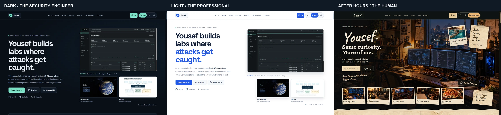
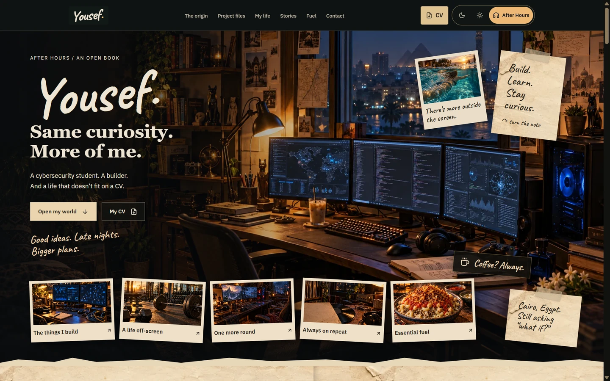

# Yousef Elbana — Portfolio

A cybersecurity engineering portfolio with three distinct experiences, one shared body of work, and an interactive personal scrapbook. Built with React, TypeScript, Vite, Tailwind CSS and Framer Motion.

## Live site

[Visit the live portfolio](https://yousefe1bana.github.io/my-portfolio/).

## Preview





## Three experiences

- **Dark — The security engineer:** precise, technical, evidence led.
- **Light — The professional:** clear engineering editorial, designed for recruiters.
- **After Hours — The human:** a night-room hero, paper spreads, taped photographs, project files, music and personal stories.

## Highlights

- Seven implemented projects, real project screenshots and expandable records. NetShield and its SOC home lab are one project; reserved repositories do not inflate counts.
- Nine certificate and award artifacts with original documents and keyboard-operable previews.
- Responsive layouts, visible focus, native dialogs, skip navigation and reduced-motion support.
- Persistent theme selection, with After Hours JavaScript, CSS and imagery loaded on demand.
- An official Spotify playlist player mounted only when opened; Discord username copying with accessible feedback.
- A public CV with no phone number. No analytics, contact backend or autoplay media.

## Local development

Use **Node.js 24** and npm. On Windows, `start.bat` installs from the lockfile and starts development.

```sh
npm ci
npm run dev
```

Vite serves the project beneath `/my-portfolio/`.

## Build and verify

```sh
npm run verify
npm run preview
```

Verification runs TypeScript, ESLint, the production build and asset/content/privacy integrity checks. With the preview running on port 4173, `npm run check:links` checks public destinations and every built file. Raw link-check evidence stays outside the publication set.

Optional asset-maintenance scripts require Python, Pillow and (for CV regeneration) ReportLab/pypdf. These are not required to develop, build or deploy the site. Original intake files are needed only when intentionally re-exporting supplied media.

## Deployment

The target repository is `YousefE1bana/my-portfolio`; Vite's base is `/my-portfolio/`. Navigation uses anchors, so no SPA routing workaround is required. `dist/` is generated and should not be committed.

The [Pages workflow](.github/workflows/pages.yml) installs with `npm ci`, verifies and builds once, uploads `dist`, then deploys with the required Pages permissions. Actions are pinned to commit SHAs. GitHub Pages uses **GitHub Actions** as its source. The workflow runs **only by manual dispatch**, never on push. To publish an update, run it from the repository's Actions tab. See [Vite's Pages guide](https://vite.dev/guide/static-deploy.html#github-pages).

## Structure

- `src/data/`: shared professional content, project inventory, credentials and personal stories.
- `src/sections/`, `src/components/`: professional sections and the lazy-loaded scrapbook.
- `src/styles/`: theme tokens and distinct professional/scrapbook treatments.
- `public/`: optimized runtime images, original credentials, CV and social/browser assets.
- `assets/source/`: retained lossless club-logo export masters, outside the deployed site.
- `docs/`: asset provenance, integrity manifests and README previews.

## Assets and attribution

See [asset provenance and licensing notes](docs/ASSETS.md). Original scene illustrations are not personal photographs or authentic project screenshots. Supplied screenshots and the proposed SHIFAA architecture remain the primary project evidence. No general reuse license is granted for this repository's personal content or assets; third-party licenses and marks retain their own terms.

## Contact

[GitHub](https://github.com/YousefE1bana) · [LinkedIn](https://www.linkedin.com/in/yousefelbana) · [TryHackMe](https://tryhackme.com/p/ELbanna) · [Email](mailto:y3usef.osama@email.com)

Discord: **usef.elbana** · [Spotify playlist](https://open.spotify.com/playlist/2mI2CeQG710cVAtFeqDkOI)
